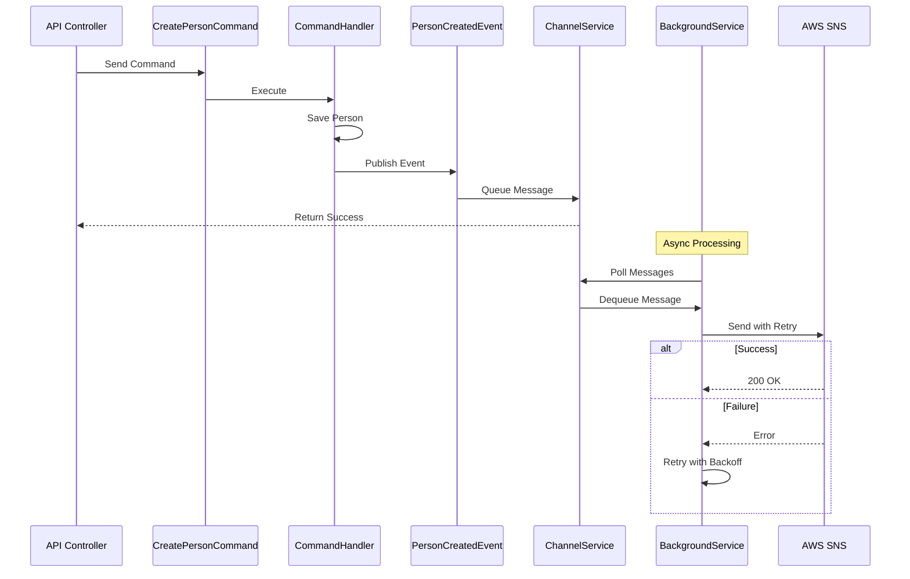

# Task001-UpdateOnCreate

## Summary

We only have placeholders for database calls in the PersonController right now, but we have the following feature request. When a person is created and after the record is saved to the database, we must send a message in the background to SNS with the updated data. Authenticating with AWS and sending the message cannot block the API from responding immediately. The app with assume a Role on their account to write to SNS. The background task should be resilient and retry on failure. It should be a durable pattern that can be reproduced elsewhere in the app, but we cannot use libraries like Quartz or Hangfire that add physical dependencies.

## Required

1. SNS message is sent
2. SNS message does not delay API response
3. Method for handling background task should be well designed, resilient, and use all
.NET best practices

## Solution: MediatR + In-Memory Channels

### Architecture Diagram

## Implementation Checklist

### 1. Infrastructure Setup
- [ ] Install MediatR and MediatR.Extensions NuGet packages
- [ ] Install AWSSDK.SimpleNotificationService NuGet package
- [ ] Configure MediatR in WebApiConfig.cs
- [ ] Add AWS configuration to Web.config (Region, RoleArn, TopicArn)

### 2. Core Messaging Infrastructure
- [ ] Create `Infrastructure/Messaging/ISnsMessageQueue.cs` interface
- [ ] Implement `Infrastructure/Messaging/SnsMessageQueue.cs` using System.Threading.Channels
- [ ] Create `Infrastructure/Messaging/SnsMessage.cs` model class
- [ ] Implement `Infrastructure/BackgroundServices/SnsBackgroundService.cs` for processing

### 3. MediatR Commands and Events
- [ ] Create `Commands/CreatePersonCommand.cs` with person data
- [ ] Implement `Commands/CreatePersonCommandHandler.cs`
- [ ] Create `Events/PersonCreatedEvent.cs` domain event
- [ ] Implement `Events/PersonCreatedEventHandler.cs` to queue SNS message

### 4. AWS Integration
- [ ] Create `Infrastructure/Aws/ISnsClient.cs` interface
- [ ] Implement `Infrastructure/Aws/SnsClient.cs` with role assumption
- [ ] Add retry policy using custom implementation (exponential backoff)
- [ ] Implement circuit breaker pattern for SNS failures

### 5. Update Controllers
- [ ] Refactor `PeopleController.Post()` to use MediatR
- [ ] Remove direct database placeholder code
- [ ] Add proper error handling and logging

### 6. Configuration and DI
- [ ] Register all services in dependency injection container
- [ ] Configure channel options (capacity, full mode behavior)
- [ ] Set up background service lifetime in Global.asax.cs
- [ ] Add health check endpoint for monitoring queue status

### 7. Error Handling and Resilience
- [ ] Implement exponential backoff (1s, 2s, 4s)
- [ ] Add maximum retry attempts (3)
- [ ] Create dead letter logging for failed messages
- [ ] Implement correlation IDs for tracing

### 8. Testing
- [ ] Unit tests for CommandHandler
- [ ] Unit tests for EventHandler
- [ ] Unit tests for SnsClient with mocked AWS
- [ ] Integration tests for full flow
- [ ] Test retry logic and circuit breaker

### 9. Monitoring and Observability
- [ ] Add logging throughout the pipeline
- [ ] Create metrics for queue size and processing time
- [ ] Log all SNS failures with context
- [ ] Add performance counters for throughput

### 10. Documentation
- [ ] Update API documentation for new behavior
- [ ] Document configuration settings
- [ ] Create runbook for troubleshooting
- [ ] Add code comments for complex logic